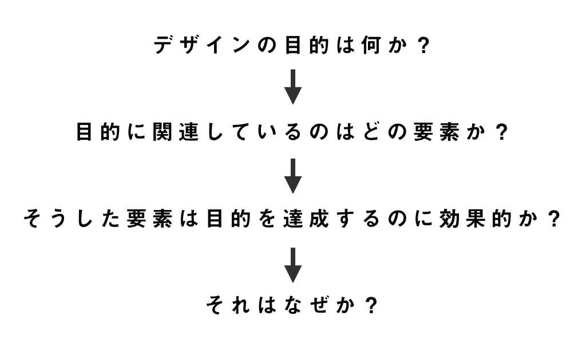

研究室で展示する機会があり、学生同士でつくっているものをあれこれ言う機会が増えたが、本当にこれで相手のためになっているのだろうかと思うことがあり、[**『みんなではじめるデザイン批評』**](https://www.amazon.co.jp/dp/4802510209) を読み始めた。

この本は結構評判がいいらしく読もうと思っていたが、なんとなく面倒で読んでいなかった。しかし、最近他人のデザインを批評することに対して直感で言うのじゃなくて、よく考えないといけないなと思い始めたので手に取った。しかしまだ読み終わってない←

重要なことは書いてあるが少し冗長だという感じがしたので、”批評をする側”に関して簡単にまとめておく。

## 目的の共有
上のは本に書いてあることそのままとってきた。言っていることは単純で、**そのデザインはどういう目的でされているのかを批評する側、される側で共有していないといけない** ということ。
言われてみれば当然という感じであるが、意外と意識できていなくてつい自分の感情や好みでデザインを判断しがちである。

研究室では全員が同じものをつくっているとは限らないので、批評を頼まれて何か気になったら、まず「〜はどんな目的でデザインしているの？」と質問して目的を共有するべきかもしれない。
それで答えが返ってきたら、「じゃあ〜のほうが良くないかな」とか「そういった目的があるなら確かにそれでいいな」と気になったところにたいする考えを言うと良さそう。

ここで「ここはこの色ではダサい」とか「これはこうするべきだ」と決めつけるのではなくて、ちゃんと目的を共有する。

批評することに関して言えばこれが本に書いてある重要なところだし、意識すべきところだと思う。

## 色や形、見た目
デザインを批評するときにやはり色、見た目が気になってしまう。しかしこれは個人的、感情的な話なので心に留めておく必要がある。

ぼくの場合はどうしても色が気になる。「なぜその色を選んだのだ。センスが悪い。」そう思いがちである。しかしこれは相手のためにもデザインのためにもなっていない。

所属している研究室はみんなデザインに少なからず興味があるから、自分のデザイン感というようなものをなんとなく持っている。しかし自分の好みで言い合うのはなんの解決にもなってない。特に色なんか個人の趣味でしか無い。

こういう批判をするのであれば、例えば今の展示風景にある色を考えてこの色のほうがいいのではないかと、**展示するという目的** を考えて批評するべきである。プロのデザイナーであれば当然の話かもしれないが、デザインを学び始めた学生にとってはわかっていても意識しにくいところである、と自分自身感じている。

## まとめ
自分のデザイン感があることは重要だと思っているのだけど、他人のためにはそこは抑えなければならないと感じている。またいいデザインを創る能力と、いいデザインのために批評する能力は別のものな気がする。両方鍛えていかないと社会に出たときつらそうだ。

また良い批評をすると作るものがよくなるというのを少し実感している。議論を深めたり、制作物をよくするために、常に **そのデザインの目的は何か** を共有することに研究室では徹していきたい。
