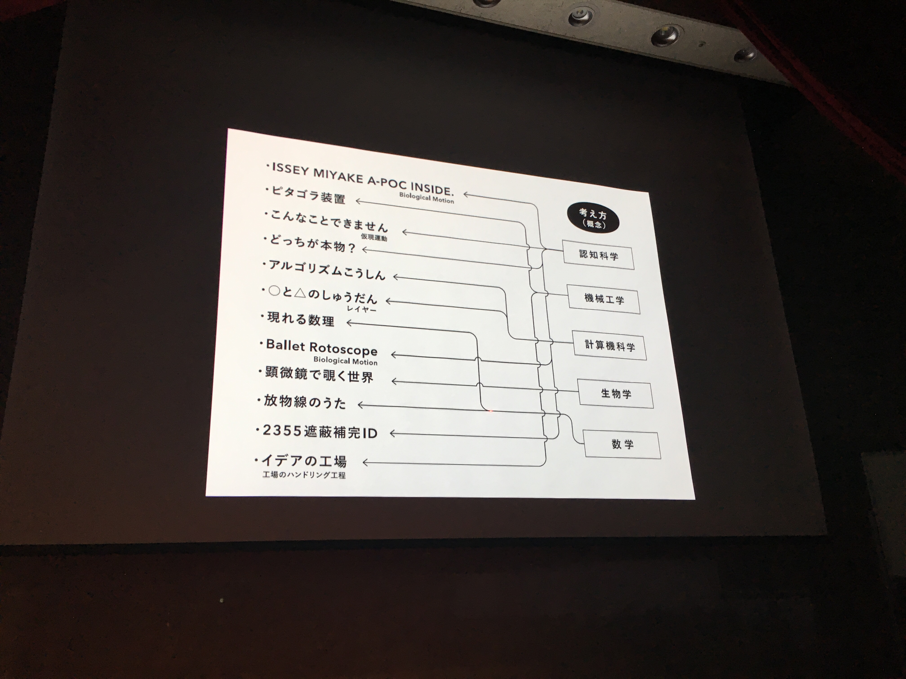

2016年12月10日に青山学院大学で佐藤雅彦さんの講演があったので行ってきた。タイトルは「**こうすると見えてくる / こうすると伝わる / こうすると分かってしまう**」

発表内容は僕的には以前から知っているものが多かった。しかし、佐藤先生の生のトークは先生が自分の興味に対してすごく楽しんでいるということが伝わってきて、とても聞いていて心地よかった。

本文では、佐藤先生が研究してきた表現の方法と、講演を聞いたあとの僕の考察を書く。

## 佐藤雅彦の研究テーマ
佐藤先生の研究テーマは **どうすればあることが伝わるのか　どうすればあることがわかるのか** ということ。

佐藤先生が **人がなんでそれがわかってしまうのか、なぜ気づくのか** ということに関して「これはぼくにとっては大問題ですよ」といっていた。人間がなんであることがわかってしまうのかということに対してすごい興味があり、常に研究しているように感じた。

佐藤先生が開発してきた研究表現は４つ。

### 1. ルール
一つ目は、方法論から作っていくと言う考え方。CMクリエイターのとき考えていたという。23のルールを作ったといっていたが、講演では、**映像を音から作る** というのを紹介していた。[サントリーのモルツ](https://www.youtube.com/watch?v=nGyQgQlNJFk)や[コイケヤのスコーン](https://www.youtube.com/watch?v=q7YXs-1zNOY)、[バザールでござーる](https://www.youtube.com/watch?v=1w14LUcTIvo)などのCMがそう。　デモ動画などを作るとき動画のどこに注目を集めたいかということを考える上では佐藤先生の製作したCMは参考になるかもしれない。

### 2. トーン
二つ目は、世界観からつくるという方法論。PlayStationの「I.Q」がその考えでつくられたらしい。

まず世界観からつくって、そのルールやコンテンツは後から考える（あとづけ）らしい。

### 3. 「考え方」から生まれる表現
三つ目は、ある概念（考え方）をどう伝えるかということに着目した表現。学生の僕たちとしてはデモ発表などのとき一番参考にしたい表現方法かもしれない。

講演で出てきたものとして

- [ピタゴラ装置](http://euphrates.jp/1859898)、アルゴリズムこうしんは計算幾何学のアルゴリズムの考え方
- [Issey Miyake A-POC INSIDE](https://www.youtube.com/watch?v=x4_mK9CebB4) は認知科学のBiological Motionという考え方
- [ballet rotosocope](https://vimeo.com/156915323) は数学の凸包（convex hull）という考え方

というようなのがあり、考え方（概念）をうまく映像で表現することで伝えている。

### 4. 「メディア」から考える
考えるカラスや0655、2355の話をしていたので、テレビというメディアの性質を使ってつくる、ということだったような気がするが、少し時間が押していたこともあってあまり聞けなかった。

## 考察

この内容について全体質問したかったのだが、残念ながら質問者多数によりできなかった。

講演を聞いて佐藤先生のコミュニケーションデザインの多くは **動き** ということが関係しているのだろうと感じた。

### 動くことによってわかる
佐藤先生の作品は、その動きによってあることがわかる、気づいてしまうというものがある。

Issey Miyake A-POC INSIDEでは、ただの点の集合が決まった動き方をすることによって、歩いている人が浮かび上がってくる。しかも男っぽいか女っぽいかもわかってしまう。動きをあたえることによって、わからない状態（点の集合）が突如に、わかる状態（歩いている人）というふうに変わる。

またピタゴラ装置のようにその装置自体をみてもそれがどうなるのかはわからないが、ビー玉を動かすことによって、こうなったらこうなるこうなったらこうなっていくというようなことがどんどんわかっていく。これも動くことによってわかるという感覚がある。

### 動きによって面白さを感じる
動いているものを見ているのは面白いと感じるが、バザールでござーるのCMであったり、ピタゴラ装置にしても、頭の中で想像している動きと現実が違う動きをすることで面白さ、あ〜そうなってしまうのか〜という感覚も面白さとしてある。

少し別の話になってしまうが、スマートフォンのアプリケーションなどを操作しているときに自分の頭の中で想像した動きとは違う予想外の動きがあると使いにくいと思うことがある。

頭の中の動きと実在の動きが違うということは、人間にとって何か面白さ、違和感を感じる原因となっている。プラスの面もあるしマイナスの面もあるということも面白い。勝手に動いたのか、自分で動かしたかでその感情が違う気がする。
この頭の中と実在の動きの差というのは、考えると面白いかもしれない。

以上、講演のメモ。
